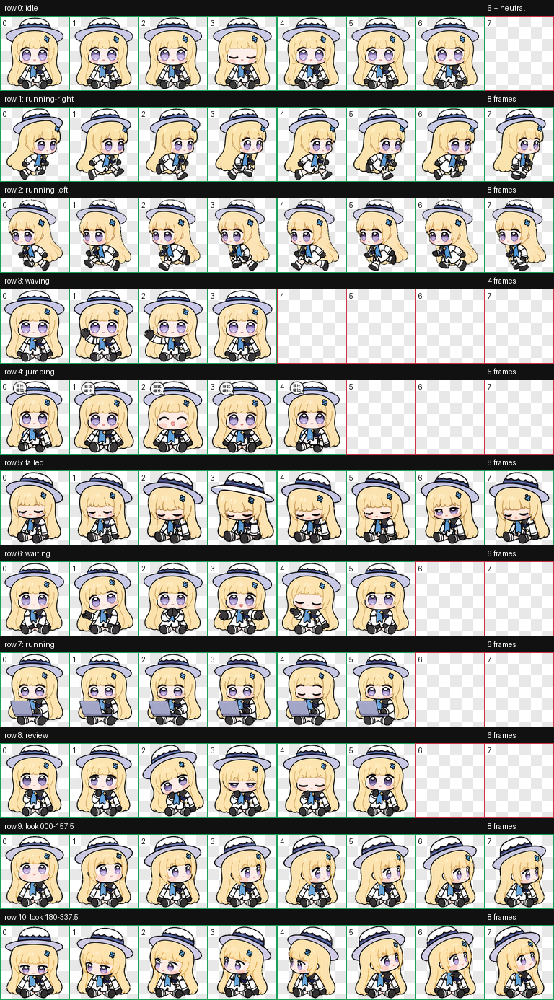

# 菲比 Codex 桌宠

[English](README.en.md)

一只适用于 Codex Desktop 的 Q 版动画桌宠。菲比采用贴近原设的柔和低对比配色，工作时会抱着笔记本电脑敲代码，鼠标悬停时会开心地弹出“菲比 / 啾比”漫画气泡。



| 任务进行中 | 开心气泡 |
| --- | --- |
|  |  |

## 功能

- 柔和、简洁、贴近原图的奶油金与淡紫 Q 版造型
- 任务进行中抱着笔记本电脑敲代码
- 鼠标悬停时开心跳动，并显示“菲比 / 啾比”漫画气泡
- 16 个鼠标指针注视方向
- Codex v2 桌宠图集，透明背景

## 环境要求

- 支持自定义桌宠的 Codex Desktop 版本
- Windows PowerShell 5.1 或更高版本

## 快速安装

克隆仓库并进入目录后运行：

```powershell
powershell -ExecutionPolicy Bypass -File .\scripts\install.ps1
```

安装器只会将菲比的两个运行文件安装到 `%USERPROFILE%\.codex\pets\feibi`。如已存在同名安装，脚本会先创建带时间戳的备份。

安装后重启 Codex Desktop；如果桌宠列表没有立即更新，也请重启应用或重新打开桌宠选择器。

## 手动安装

1. 创建目录 `%USERPROFILE%\.codex\pets\feibi`。
2. 将以下两个文件复制到该目录：
   - `pet/feibi/pet.json`
   - `pet/feibi/spritesheet.webp`
3. 重启 Codex Desktop，并在桌宠选择器中选择“菲比”。

## 卸载

在仓库根目录运行：

```powershell
powershell -ExecutionPolicy Bypass -File .\scripts\uninstall.ps1
```

卸载脚本仅处理 `%USERPROFILE%\.codex\pets\feibi`，不会改动其他桌宠。

## 点击行为与限制

点击菲比会保留 Codex Desktop 的原生行为：打开并聚焦 Codex 主窗口。当前自定义桌宠 schema 不能绑定“仅点击时播放”的独立动画，因此“菲比 / 啾比”气泡使用悬停状态呈现。

## 仓库结构

```text
assets/          GitHub 预览图片与 GIF
pet/feibi/      可安装的 pet.json 与 spritesheet.webp
scripts/         安装与卸载脚本
tests/           包结构与资源校验
```

## 验证资源包

```powershell
powershell -ExecutionPolicy Bypass -File .\tests\Test-Package.ps1
```

`checksums.sha256` 记录了可安装清单和精灵图的 SHA-256，便于发布前核对文件完整性。

## 参与贡献

请阅读 [CONTRIBUTING.md](CONTRIBUTING.md)。安全问题请遵循 [SECURITY.md](SECURITY.md)，不要公开披露。

## 许可证

本项目使用 [MIT License](LICENSE)。
